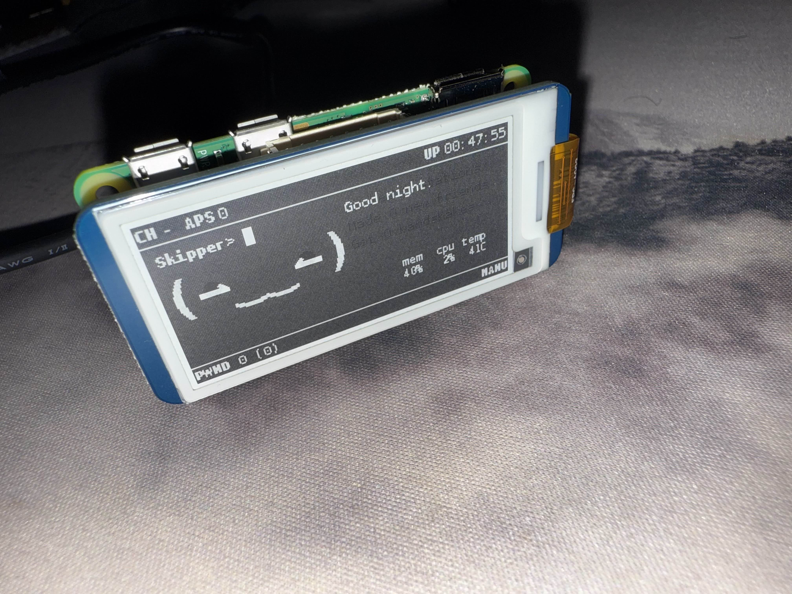
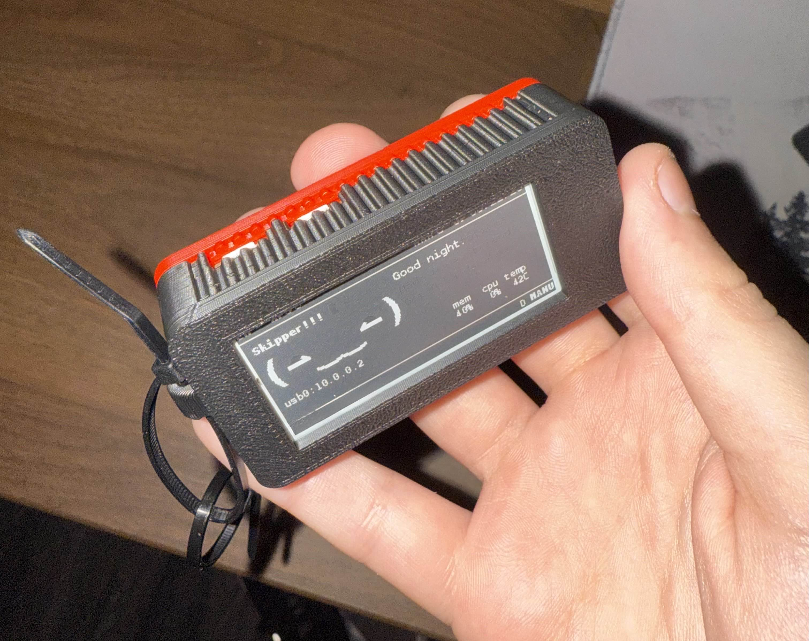

# How to build a Pwnagotchi

### What is a Pwnagotchi
A Pwnagotchi is a powerful educational tool for cybersecurity students to explore wireless network vulnerabilities and ethical hacking in a controlled and responsible manner. It combines practical skills with theoretical knowledge in Wi-Fi security and penetration testing.

### Parts list with their respective links
-  [Pi Zero 2 WH](https://www.amazon.com/dp/B0DKKXS4RV?ref=ppx_yo2ov_dt_b_fed_asin_title) Pre Soldered Header
-  [Waveshare 4 Display](https://www.amazon.com/dp/B07Z1WYRQH?ref=ppx_yo2ov_dt_b_fed_asin_title)
- Micro SD card (does not need tons of storage, recommend 32 GB).
- Micro USB cable with data transferability.

# Getting started
- This guide will be using jayofelony's image as he has been consistently updating it.
- We will need to install [balenaEtcher](https://etcher.balena.io/) to write the pwnagotchi image to the device.
- Grab the latest release of [jayofelony's image](https://github.com/jayofelony/pwnagotchi/releases/). In my case I grabbed the current latest which was pwnagotchi-2.9.5-64bit.img.xz.
- Insert micro sd card into your PC.
    - Launch balenaEtcher and select "Flash from file" then select the image downloaded from
jayofelony's releases. 
    - Next click on "Select target" and click on your micro sd card. 
    - Then click flash.
### Troubleshooting steps for flashing
- If you get an error in balenaEtcher try the following steps.
    - Restart balenaEtcher and try again.
    - On Windows go to Disk Management, find your micro sd card and delete all volumes then reformat it and try to flash again.
    If after trying the above you are still having issues try using the Raspberry Pi imager.

# Set up
### Hardware
 - Once you have successfully flashed the image onto the micro sd card insert it into the Pi Zero.
 - Connect the Waveshare display to the Pi Zero via the GPIO pins.
 - The Pi Zero has two micro usb connectors. You want to connect it to the one on the right (if they are facing away from you) as that micro usb allows for data and power.

### Windows
 - Once plugged into pc via micro usb cable. You will want to head to Device Manager and expand Network adapters, Ports (COM & LPT) and Universal Serial Bus controllers. 
 - If your computer has the driver installed you will see a device under network adapters called USB Ethernet/RNDIS Gadget. If you do not see this, we will fix it by installing the [driver](https://github.com/jayofelony/pwnagotchi/wiki/mod-rndis-driver-windows.zip) needed.
 - Once driver has been installed and extracted you want to double click on the RNDIS.inf file.
 - Now that the driver has been installed you may want to unplug the pi zero and reconnect it so it is picked up as USB Ethernet/RNDIS Gadget under network adapters.
 - Next we will want to open Control Panel and follow this path *Control Panel -> Network and Internet -> Network and Internet -> Network and Sharing Center -> Change adapter settings*.
 - We then want to find the Ethernet that has USB Ethernet/RNDIS Gadget below it, then double click it, go to properties and find Internet Protocol Version 4(TCP/IPv4) and double click again.
 - The following are the IP, Subnet mask, and gateway you want to use to connect to your pwnagotchi
    - IP address: 10.0.0.1
    - Subnet mask: 255.255.255.0
    - Default Gateway: 10.0.0.1
 - Once these settings have been set click ok to close out of the menus.
 - With these change done you should be able to ssh to your pwnagotchi (wait 5 to 10 mins).
 - Open terminal and ssh usig the following command `ssh pi@10.0.0.2`. The default password is **raspberry**

 # Pwnagotchi configuration
 - Now that we have succesfully gotten into our pwnagotchi you want to run the setup wizard with the following commands `sudo pwnagotchi --wizard`. *Once you get to display question, the display linked in this guide is waveshare_4*
 - Now that the setup is complete and your pwnagotchi has restarted you can go on your browser and go to the following URL to a web gui `http://10.0.0.2:8080/` (un: changeme pw: changeme) where you can adjust settings and enable plugins.
 - Pwnagotchi allows for third party plugins on top of the ones already included. Here is a site that hosts stable [plugins](https://pwnagotchi.org/3rd-party-plugins/index.html).
 - Some of the included plugins may not work with the current version you are using for of pwnagotchi image.

# Conclusion

- You have successfully built a pwnagotchi and the world is your oyster. **Only use this on networks you are authorized to.** 

# Helpful resources
- [PWNY WIKI](https://pwnagotchi.org/index.html)
- Adding 3rd party [plugins](https://pwnagotchi.org/3rd-party-plugins/index.html)
- 3D printable cases [here](https://pwnagotchi.org/3d-printable-cases/index.html)
- Troubleshooting pwnagotchi connection [Cybercat Labs script helped](https://www.youtube.com/watch?v=Ktx0oP6oo9w&t=1s&ab_channel=CybercatLabs)
